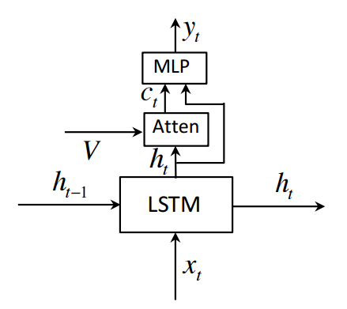

# Image Captioning with Spatial Attention in Keras

This is a Keras & Tensorflow implementation of a captioning model. In particular, it uses the attention model described in [this](https://arxiv.org/abs/1612.01887) paper, which is depicted below:


<p align="center">
  
</p>


## Installation

- Install [python 2.7](https://www.python.org/).
- Install [tensorflow 0.12](https://github.com/tensorflow/tensorflow/blob/r0.12/tensorflow/g3doc/get_started/os_setup.md).
- ```pip install -r requirements.txt```
- Set tensorflow as the keras backend in ```~/.keras/keras.json```:

```json
{
    "image_dim_ordering": "tf", 
    "epsilon": 1e-07, 
    "floatx": "float32", 
    "backend": "tensorflow"
}
```

## Data & Pretrained model

- Download [MS COCO Caption Challenge 2015 dataset](http://mscoco.org/dataset/#captions-challenge2015)
- [When available] Download pretrained model [here]().

## Usage

Unless stated otherwise, run all commands from ```./sat_keras```:

### Demo

Run ```sample_captions.py``` to test the trained network on some validation images.

### Training

- Prepare data with ```python setup.py```. 
- Run ```python train.py```. Run ```python args.py --help``` for a list of the available arguments to pass.

### Testing

- Run ```python test.py``` to forward all validation images through a trained network and create json file with results
- Navigate to ```./sat_keras/coco-captions/```. 
- From there run: 
  ```
  python eval_caps.py -results_file results.json -ann_file gt_file
  ``` 
  to get METEOR, Bleu, ROUGE_L & CIDEr scores for the previous json file with generated captions. 

## References

- Xu et al. [Show, Attend and Tell: Neural Image Caption Generation with Visual Attention.](http://www.jmlr.org/proceedings/papers/v37/xuc15.pdf) ICML 2015.
- Lu et al. [Knowing When to Look: Adaptive Attention via A Visual Sentinel for Image Captioning](https://arxiv.org/abs/1612.01887)
- Caption evaluation code from [this repository](https://github.com/tylin/coco-caption).

## Contact

For questions and suggestions either use the issues section or send an e-mail to amaia.salvador@upc.edu.
